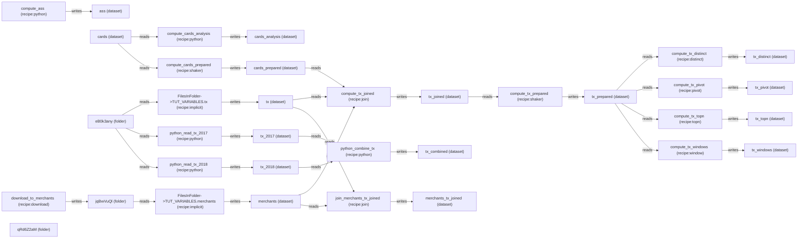

# Flow Map Summary

Generated: 2026-02-10T16:15:39.743Z
Project: TUT_VARIABLES

## Quick Read
- Nodes: 35
- Edges: 34
- Recipes: 16
- Datasets: 16
- Roots: 5
- Leaves: 9
- Warnings: 0

## Recipe Types
| Type | Count |
| --- | ---: |
| python | 5 |
| shaker | 2 |
| join | 2 |
| implicit | 2 |
| distinct | 1 |
| pivot | 1 |
| topn | 1 |
| window | 1 |
| download | 1 |

## Edges
- cards_prepared -> compute_tx_joined (reads)
- cards -> compute_cards_analysis (reads)
- cards -> compute_cards_prepared (reads)
- compute_ass -> ass (writes)
- compute_cards_analysis -> cards_analysis (writes)
- compute_cards_prepared -> cards_prepared (writes)
- compute_tx_distinct -> tx_distinct (writes)
- compute_tx_joined -> tx_joined (writes)
- compute_tx_pivot -> tx_pivot (writes)
- compute_tx_prepared -> tx_prepared (writes)
- compute_tx_topn -> tx_topn (writes)
- compute_tx_windows -> tx_windows (writes)
- download_to_merchants -> jqBwVuQl (writes)
- eB0k3any -> FilesInFolder->TUT_VARIABLES.tx (reads)
- eB0k3any -> python_read_tx_2017 (reads)
- eB0k3any -> python_read_tx_2018 (reads)
- FilesInFolder->TUT_VARIABLES.merchants -> merchants (writes)
- FilesInFolder->TUT_VARIABLES.tx -> tx (writes)
- join_merchants_tx_joined -> merchants_tx_joined (writes)
- jqBwVuQl -> FilesInFolder->TUT_VARIABLES.merchants (reads)
- merchants -> compute_tx_joined (reads)
- merchants -> join_merchants_tx_joined (reads)
- python_combine_tx -> tx_combined (writes)
- python_read_tx_2017 -> tx_2017 (writes)
- python_read_tx_2018 -> tx_2018 (writes)
- tx_2017 -> python_combine_tx (reads)
- tx_2018 -> python_combine_tx (reads)
- tx_joined -> compute_tx_prepared (reads)
- tx_prepared -> compute_tx_distinct (reads)
- tx_prepared -> compute_tx_pivot (reads)
- tx_prepared -> compute_tx_topn (reads)
- tx_prepared -> compute_tx_windows (reads)
- tx -> compute_tx_joined (reads)
- tx -> join_merchants_tx_joined (reads)

## Recipe Pipelines
- compute_ass (python): (none) -> ass
- compute_cards_analysis (python): cards -> cards_analysis
- compute_cards_prepared (shaker): cards -> cards_prepared
- compute_tx_distinct (distinct): tx_prepared -> tx_distinct
- compute_tx_joined (join): cards_prepared, merchants, tx -> tx_joined
- compute_tx_pivot (pivot): tx_prepared -> tx_pivot
- compute_tx_prepared (shaker): tx_joined -> tx_prepared
- compute_tx_topn (topn): tx_prepared -> tx_topn
- compute_tx_windows (window): tx_prepared -> tx_windows
- download_to_merchants (download): (none) -> jqBwVuQl
- FilesInFolder->TUT_VARIABLES.merchants (implicit): jqBwVuQl -> merchants
- FilesInFolder->TUT_VARIABLES.tx (implicit): eB0k3any -> tx
- join_merchants_tx_joined (join): merchants, tx -> merchants_tx_joined
- python_combine_tx (python): tx_2017, tx_2018 -> tx_combined
- python_read_tx_2017 (python): eB0k3any -> tx_2017
- python_read_tx_2018 (python): eB0k3any -> tx_2018

## Mermaid

